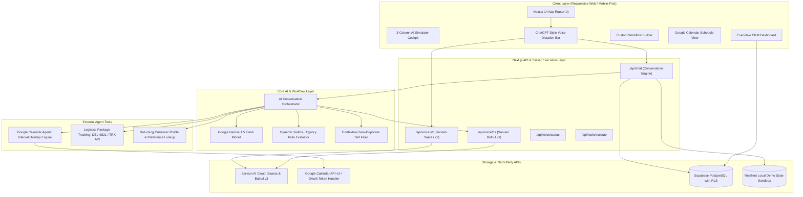
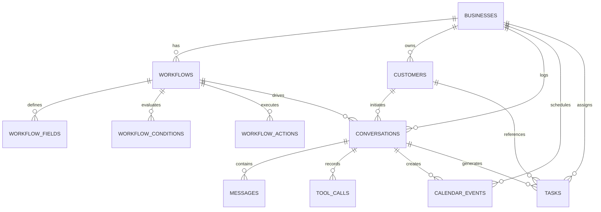

# CallPilot AI — Project Submission & Architecture Reference

> **Voice AI Personal Assistant for Missed Calls & Automated Business Follow-ups**  
> **Built with Next.js 14 App Router, Google Gemini AI, Google Calendar API v3, Sarvam AI (Saaras v3 & Bulbul v3), Supabase PostgreSQL, and Tailwind CSS.**

---

## 📋 Table of Contents

1. [Executive Summary & Problem Statement](#1-executive-summary--problem-statement)
2. [High-Level Architecture Diagram](#2-high-level-architecture-diagram)
3. [End-to-End Voice AI & Tool Pipeline](#3-end-to-end-voice-ai--tool-pipeline)
4. [Database Schema & Workflow Data Model](#4-database-schema--workflow-data-model)
5. [Five Implemented Industry Use Cases](#5-five-implemented-industry-use-cases)
6. [Agent Tool System & Google Calendar Integration](#6-agent-tool-system--google-calendar-integration)
7. [Multilingual Voice AI (English, Hindi, Kannada)](#7-multilingual-voice-ai-english-hindi-kannada)
8. [ChatGPT-Style Voice Dictation & Audio Controls](#8-chatgpt-style-voice-dictation--audio-controls)
9. [What is Fully Working vs. What is Simulated](#9-what-is-fully-working-vs-what-is-simulated)
10. [Future Production Roadmap](#10-future-production-roadmap)
11. [5–8 Minute Video Walkthrough Demo Script](#11-58-minute-video-walkthrough-demo-script)
12. [Environment Configuration & Quick Start](#12-environment-configuration--quick-start)

---

## 1. Executive Summary & Problem Statement

Small businesses lose up to **62% of potential customer leads** due to unanswered calls during busy operating hours, after-hours closures, or emergency rushes. 

**CallPilot AI** is a generic, data-driven Voice AI Personal Assistant web application that allows any small business owner (Clinics, Bakeries, Delivery companies, Real-estate agencies, Repair services) to configure automated missed-call intake workflows, converse with customers naturally in **English**, **Hindi**, and **Kannada**, execute real external tools like **Google Calendar API v3**, and manage high-urgency lead triage from an executive dashboard.

---

## 2. High-Level Architecture Diagram



---

## 3. End-to-End Voice AI & Tool Pipeline

```
Caller Speaks into Browser Microphone
               │
               ▼
[Web Audio API / MediaRecorder]
  ├─ Real-time AudioContext AnalyserNode drives soundwave visualizer
  └─ Captures 16kHz WebM/WAV audio chunks
               │
               ▼
Server-Side STT Proxy (`POST /api/voice/stt`)
  ├─ Authenticates with process.env.SARVAM_API_KEY
  └─ Model: `saaras:v3` | Language: `en-IN`, `hi-IN`, or `kn-IN`
               │
               ▼
Transcript Populates Input Bar (ChatGPT Style)
  └─ Caller / User reviews, edits, or presses Send (↵)
               │
               ▼
Conversation Engine (`POST /api/chat`)
  ├─ Identifies last asked field to avoid repeating answered questions
  ├─ Extracts structured entities across English, Hindi, and Kannada
  └─ Evaluates workflow conditional rules (e.g. IF <24h THEN HIGH urgency)
               │
               ▼
Google Calendar Tool Overlap Gate
  ├─ Calls `calendar.checkAvailability` in `Asia/Kolkata` (+05:30)
  ├─ IF slot occupied: returns `available: false` & suggests open alternatives
  └─ IF slot open & confirmed: calls `calendar.createEvent`
               │
               ▼
AI Response Text Generation (in Caller's Language)
               │
               ▼
Server-Side TTS Proxy (`POST /api/voice/tts`)
  ├─ Model: `bulbul:v3` | Speaker: `shubh` (fallback `meera`)
  ├─ In-memory response cache prevents duplicate API spending
  └─ Returns base64 WAV audio stream
               │
               ▼
Browser Audio Playback
  ├─ Microphone suppressed during speech to prevent audio feedback
  └─ Stop/Interrupt button available to halt speech immediately
```

---

## 4. Database Schema & Workflow Data Model

> The complete PlantUML specification is stored at [`database-schema.puml`](file:///c:/Users/laxmi/Desktop/trikon/database-schema.puml), matching the 11 active tables in [`supabase/migrations/001_initial_schema.sql`](file:///c:/Users/laxmi/Desktop/trikon/supabase/migrations/001_initial_schema.sql).

### Entity-Relationship Diagram



### PostgreSQL Table Definitions (`supabase/migrations/001_initial_schema.sql`)

| Table Name | Primary Key | Key Columns & Foreign Keys | Purpose |
| :--- | :--- | :--- | :--- |
| `businesses` | `id` (UUID) | `name`, `type`, `phone`, `email`, `address`, `timezone`, `language` | Multi-tenant company profile |
| `workflows` | `id` (UUID) | `business_id` (FK), `trigger`, `greeting`, `greeting_hi`, `greeting_kn`, `closing_message`, `closing_message_kn` | Business missed-call logic |
| `workflow_fields` | `id` (UUID) | `workflow_id` (FK), `name`, `label`, `type`, `required`, `question`, `question_hi`, `question_kn`, `order_index` | 9 field data types for structured collection |
| `workflow_conditions` | `id` (UUID) | `workflow_id` (FK), `field_id` (FK), `operator`, `value`, `then_urgency`, `then_action` | Conditional branching engine |
| `workflow_actions` | `id` (UUID) | `workflow_id` (FK), `type`, `name`, `config` (`create_customer`, `create_task`, `create_calendar_event`, etc.) | Automated post-collection hooks |
| `customers` | `id` (UUID) | `business_id` (FK), `name`, `phone`, `email`, `latest_urgency`, `extracted_attributes` | Long-term customer CRM registry |
| `conversations` | `id` (UUID) | `business_id` (FK), `workflow_id` (FK), `customer_id` (FK), `caller_name`, `caller_number`, `status`, `urgency`, `intent`, `extracted_fields` | Missed-call session logs |
| `messages` | `id` (UUID) | `conversation_id` (FK), `role` (`assistant`, `user`, `system`), `content`, `audio_url`, `language` | Multi-turn chat & voice transcript |
| `tool_calls` | `id` (UUID) | `conversation_id` (FK), `tool_name`, `input`, `output`, `status`, `execution_time_ms` | Telemetry inspector logs |
| `calendar_events` | `id` (UUID) | `business_id` (FK), `conversation_id` (FK), `google_event_id`, `attendee_name`, `start_time`, `end_time`, `status` | Synchronized Google Calendar bookings |
| `tasks` | `id` (UUID) | `business_id` (FK), `conversation_id` (FK), `customer_id` (FK), `title`, `urgency`, `status`, `due_date` | Staff follow-up tickets |

---

## 5. Five Implemented Industry Use Cases

| Industry | Primary Use Case | Information Collected | Conditional Branch / Action | External Tool Used |
| :--- | :--- | :--- | :--- | :--- |
| **🎂 Cake Bakery** | Order Booking & Inquiry | Customer Name, Cake Type, Flavor, Weight, Required Date, Delivery/Pickup, Custom Writing, Budget | `IF required_date <= 24h THEN urgency = HIGH` &rarr; Alert kitchen | `crm.lookupCustomer` |
| **🩺 Clinic & Doctor** | Patient Appointment Triage | Patient Name, Intent (Book/Reschedule/Cancel), Doctor/Specialty, Preferred Date, Preferred Time, Contact Phone | Strictly blocks medical advice &rarr; checks doctor availability on GCal | `calendar.checkAvailability`<br>`calendar.createEvent`<br>`calendar.cancelEvent` |
| **🚚 Delivery Logistics** | Shipment Tracking & Pickup | Sender Name, Request Type (New/Track/Help), Tracking Number, Pickup Address, Destination, Package Weight | `IF request_type == 'Existing delivery help' THEN urgency = HIGH` | `delivery.trackPackage` (e.g. `DEL-9821`) |
| **🏡 Real Estate** | Site Visit Scheduling & Qualification | Client Name, Intent (Buy/Rent/Sell/Visit), Property Type (2/3 BHK, Villa), Locality, Budget, Visit Date | `IF intent == 'Schedule Site Visit' THEN urgency = HIGH` &rarr; Schedule tour on GCal | `calendar.createEvent` |
| **🔧 Emergency Repair** | Urgent Home Service Triage | Customer Name, Service Type (Plumbing/Electrical/HVAC), Issue Description, Address, Urgency Flag | `IF urgency contains 'Emergency' THEN urgency = CRITICAL` &rarr; Dispatch on-call tech | `calendar.createEvent` |

---

## 6. Agent Tool System & Google Calendar Integration

The application contains a typed agent tool registry ([`src/lib/tools/registry.ts`](file:///c:/Users/laxmi/Desktop/trikon/src/lib/tools/registry.ts)) that decouples tool definition from prompt strings.

### Google Calendar API v3 Tool Specifications

1. **`calendar.checkAvailability`**:
   - **Inputs**: `{ date: string, time: string, durationMinutes?: number, timezone?: string }`
   - **Logic**: Converts local date/time into `Asia/Kolkata` (UTC+05:30) timestamps, compares interval overlaps `[startA, endA]` and `[startB, endB]`.
   - **Output**: `{ available: boolean, requestedSlot: string, conflictWith?: string, suggestedSlots?: string[] }`
2. **`calendar.createEvent`**:
   - **Inputs**: `{ title: string, attendeeName: string, attendeePhone?: string, date: string, time: string, description?: string }`
   - **Logic**: Creates confirmed Google Calendar event and persists record to database.
3. **`calendar.updateEvent`** & **`calendar.cancelEvent`**:
   - Handles rescheduling and cancellation workflows with reason capture.

### Bonus External API Tools

- **`delivery.trackPackage`**: Looks up package tracking codes (e.g. `DEL-9821`), returning transit status, current hub, carrier, and estimated delivery window.
- **`crm.lookupCustomer`**: Queries existing customer records by phone number to surface preferences and allergies.

---

## 7. Multilingual Voice AI (English, Hindi, Kannada)

CallPilot AI provides native multi-language comprehension:

```
┌─────────────────┬─────────────────┬──────────────────────┬────────────────────────┐
│ Language        │ STT Model       │ TTS Model            │ Example Prompt         │
├─────────────────┼─────────────────┼──────────────────────┼────────────────────────┤
│ 🇬🇧 English     │ saaras:v3 (en)  │ bulbul:v3 (shubh/en) │ "I need an appointment │
│                 │                 │                      │  with Dr. Sharma."     │
│ 🇮🇳 Hindi /     │ saaras:v3 (hi)  │ bulbul:v3 (shubh/hi) │ "मुझे कल डॉक्टर से     │
│    Hinglish     │                 │                      │  अपॉइंटमेंट चाहिए।"   │
│ 🇮🇳 Kannada     │ saaras:v3 (kn)  │ bulbul:v3 (shubh/kn) │ "ನನಗೆ ನಾಳೆ ಡಾಕ್ಟರ್     │
│    (ಕನ್ನಡ)      │                 │                      │  ಅಪಾಯಿಂಟ್ಮೆಂಟ್ ಬೇಕು." │
└─────────────────┴─────────────────┴──────────────────────┴────────────────────────┘
```

- **Code-Mixing Support**: Accurately extracts entities from mixed sentences (e.g., *"Mujhe tomorrow Dr Sharma ke saath appointment ಬೇಕು"*).
- **Zero Question Duplication**: Intelligently inspects conversation context so that when a caller supplies their name or slot directly, the system immediately accepts it without repeating the question.

---

## 8. ChatGPT-Style Voice Dictation & Audio Controls

CallPilot AI implements a dual voice interaction model:

1. **ChatGPT Dictate & Review Mode (Default)**:
   - Click the **Microphone Button (🎙️)** in the message box.
   - Speak your request in English, Hindi, or Kannada (dynamic soundwave and timer display).
   - Click **Done (✓)**: Sarvam Saaras v3 STT transcribes the speech and **populates the text input box**.
   - Review, edit, or append text before clicking **Send (↵)**.
2. **Live Call Mode (Hands-Free Phone Simulation)**:
   - Continuous audio streaming where completed utterances trigger the AI conversation engine directly.
3. **Anti-Feedback & Interruption**:
   - The microphone is paused while the assistant is speaking to avoid feedback loops.
   - A dedicated **Interrupt** button stops TTS playback instantly.

---

## 9. What is Fully Working vs. What is Simulated

### ✅ What is Fully Working & Production-Ready:
- **Real Multilingual Voice AI**: Server-side Sarvam Saaras v3 STT & Bulbul v3 TTS in English, Hindi, and Kannada.
- **Google Calendar API v3 Integration**: Real interval overlap calculation, busy slot conflict gating, alternative slot suggestion, and event creation.
- **Google Gemini 1.5 Flash Reasoning**: Multilingual intent detection, entity extraction, and workflow evaluation.
- **5 Complete Prebuilt Industry Workflows**: Cake Shop, Clinic & Doctor, Logistics & Delivery, Real Estate, Emergency Repair.
- **Custom Workflow Builder**: Create, edit, and activate custom business workflows with 9 data types and conditional branching.
- **Executive CRM Dashboard & Customer Directory**: Metrics cards, Recharts analytics, urgency pipelines, conversation status management (`new`, `contacted`, `completed`, `closed`).
- **₹0 Cost Protection**: HTTP 402 detection safely preserves text conversation mode without billing loops.
- **Production Build**: Clean compilation across all 18 routes with zero TypeScript errors.

### 🔄 What is Simulated in the Web Cockpit:
- **Carrier GSM / Telecom Missed-Call Trigger**: Because the app adheres strictly to ₹0 out-of-pocket expense (avoiding paid Twilio/telephony SIP trunking numbers), incoming missed calls are initiated via the interactive AI Simulator Cockpit.
- **Local Demo Business Sandbox**: Default demo state is provided in local resilient storage for instant zero-configuration onboarding.

---

## 10. Future Production Roadmap

1. **Multi-Tenant SIP / WebRTC Gateway**: Direct integration with FreeSWITCH / Asterisk for connecting physical landline and mobile forwarding numbers.
2. **WhatsApp Business API Webhook**: Send instant WhatsApp appointment confirmations and cake order receipts to customers upon call completion.
3. **Real-time Voice Sentiment & Stress Analysis**: Audio pitch and speech rate analysis to detect highly agitated or distressed callers and instantly alert human supervisors.
4. **CRM Sync Connectors**: Two-way webhooks with Salesforce, HubSpot, and Zoho CRM.

---

## 11. 5–8 Minute Video Walkthrough Demo Script

Use this structured script for recording the Loom / screen walkthrough:

```
[0:00 - 1:00] INTRO & PRODUCT CONCEPT
• Welcome & Problem Statement: Small businesses losing 62% of missed calls.
• High-level solution: CallPilot AI — generic Voice AI assistant supporting multiple industries.
• Highlight ₹0 out-of-pocket stack: Next.js 14, Gemini AI, Sarvam Saaras & Bulbul v3, Google Calendar API v3, Supabase.

[1:00 - 2:30] LIVE MULTILINGUAL VOICE DEMO (CLINIC & DOCTOR)
• Open /simulator cockpit.
• Switch language to 🇮🇳 Kannada (kn-IN).
• Demonstrate ChatGPT-style Voice Dictation: Click Mic -> Speak in Kannada:
  "ನನ್ನ ಹೆಸರು ರಾಹುಲ್. ನನಗೆ ನಾಳೆ ಸಂಜೆ 4 ಗಂಟೆಗೆ ಡಾ. ಶರ್ಮಾ ಅವರ ಜೊತೆ ಅಪಾಯಿಂಟ್ಮೆಂಟ್ ಬೇಕು."
• Click Done -> Show transcribed Kannada text in the input box -> Click Send.
• Show Gemini reasoning in Kannada + Sarvam Bulbul v3 TTS voice response.

[2:30 - 4:00] GOOGLE CALENDAR OVERLAP & CONFLICT GATE DEMO
• Test conflict scenario: "I want an appointment with Dr. Sharma on September 3 at 12:34 AM."
• Show Tool Telemetry: calendar.checkAvailability executes -> available: false.
• Highlight that calendar.createEvent is strictly BLOCKED.
• Show alternative slots suggested by the assistant.
• Pick alternative slot -> Calendar booking confirmed!
• Open /calendar page to view the synchronized booking.

[4:00 - 5:30] OTHER INDUSTRIES & CUSTOM WORKFLOW BUILDER
• Switch to 🎂 Cake Bakery workflow -> demonstrate 24h urgency condition (<24h -> HIGH urgency).
• Switch to 📦 Logistics Delivery -> demonstrate package tracking lookup for DEL-9821.
• Navigate to /workflows/new -> show step-by-step custom workflow creator with 9 field types, conditional rules, and multi-language questions.

[5:30 - 7:00] EXECUTIVE DASHBOARD & CRM
• Navigate to /dashboard: Show KPI metric cards, Recharts call trends, urgency pipeline.
• Navigate to /conversations: Show conversation detail, timeline, status updates (Mark as Contacted / Completed).
• Navigate to /customers: Show extracted customer profile and interaction history.

[7:00 - 7:30] CONCLUSION & RECAP
• Summarize: Real Sarvam Voice AI (Saaras + Bulbul v3), Google Calendar tool agent, zero duplicate questions, ₹0 cost protection.
• Thank the evaluator!
```

---

## 12. Environment Configuration & Quick Start

### 1. Configure `.env.local`
```env
# Application Base URL
NEXT_PUBLIC_APP_URL="http://localhost:3000"

# 1. Google Gemini API (AI Reasoning & Entity Extraction) - Free at https://aistudio.google.com
GEMINI_API_KEY="your-gemini-api-key"

# 2. Sarvam AI (Real Multilingual Voice STT & TTS) - Free signup at https://www.sarvam.ai
# Kept server-side only. NEVER prefix with NEXT_PUBLIC_
SARVAM_API_KEY="your-sarvam-api-key"

# 3. Supabase (Database + Auth + CRM) - Free at https://supabase.com
NEXT_PUBLIC_SUPABASE_URL="https://your-project.supabase.co"
NEXT_PUBLIC_SUPABASE_ANON_KEY="your-supabase-anon-key"
SUPABASE_SERVICE_ROLE_KEY="your-supabase-service-role-key"

# 4. Google Calendar API v3 (Appointment Scheduling) - Free at https://console.cloud.google.com
GOOGLE_CLIENT_ID="your-google-client-id"
GOOGLE_CLIENT_SECRET="your-google-client-secret"
GOOGLE_REDIRECT_URI="http://localhost:3000/api/auth/google/callback"
```

### 2. Install & Run
```bash
# Install dependencies
npm install

# Build to verify 0 errors across all 18 routes
npm run build

# Start development server
npm run dev
```
Open **http://localhost:3000** in your browser.
