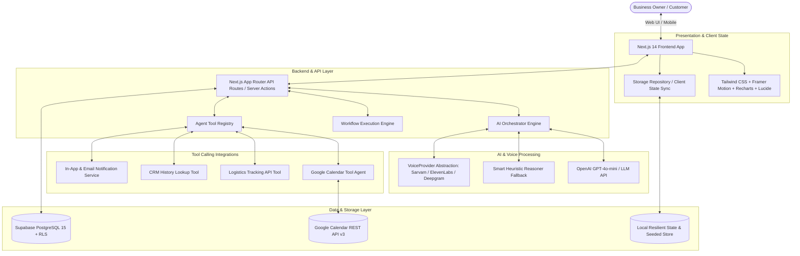

# CallPilot AI - System Architecture

CallPilot AI is built on an enterprise-grade modular architecture designed for high-concurrency voice/chat orchestration, data-driven workflow evaluation, agentic tool execution, and real-time CRM updates.

---

## 1. End-to-End Architecture Diagram

---

## 2. Core Subsystems

### A. Next.js 14 Frontend Layer
- **Landing Page (`/`)**: Conversion-focused showcase with hero simulation, workflow animation, use case tabs, ROI counters, and calendar preview.
- **AI Simulator (`/simulator`)**: 3-column interactive cockpit:
  - Left column: Active Workflow overview, prompt starters, template switcher.
  - Center column: Live chat stream, voice visualizer, input box.
  - Right column: Real-time extracted fields with animated pulse effects + expandable developer tool execution inspector.
- **Workflow Builder (`/workflows/new`, `/workflows/[id]`)**: Step-by-step visual editor for Greeting, Fields, Custom Types, Conditional Logic, Actions, and Notification settings.
- **Dashboard (`/dashboard`)**: KPI metric cards, Recharts trends, intent distributions, urgency alert banner, and recent conversations table.
- **Customer CRM (`/customers`)**: Lifetime records, extracted attributes, conversation history, and contact timeline.
- **Calendar (`/calendar`)**: Sync status, scheduled appointments, callbacks, and direct event manager.

### B. AI Orchestrator (`src/lib/ai/orchestrator.ts`)
- Dynamically injects business profile, active workflow fields, collected entities, conversation history, and available tool schemas into prompt.
- Executes multi-turn reasoning and tool invocation cycles.
- Multilingual support for English, Hindi, and Hinglish with automatic language detection.
- Seamless dual-mode: Uses OpenAI API when keys are configured, and a smart local heuristic parser when operating in zero-dependency demo mode.

### C. Workflow Engine (`src/lib/workflow/engine.ts`)
- Pure, data-driven workflow evaluation.
- Validates field data types (Text, Number, Date, Time, Phone, Email, Select, Address, Boolean).
- Evaluates conditional rules (e.g. `IF required_date <= 24h THEN urgency = HIGH`).
- Triggers follow-up actions (CRM record creation, Task assignment, Calendar event synchronization, Baker / Doctor notifications).

### D. Tool-Calling Engine (`src/lib/tools/`)
- Standardized tool interface: `AgentTool { name, displayName, description, parameters, execute }`.
- Integrations:
  - `calendar.checkAvailability`: Free/busy inspection.
  - `calendar.createEvent`: Google Calendar event booking.
  - `calendar.updateEvent`: Appointment rescheduling.
  - `calendar.cancelEvent`: Appointment cancellation.
  - `delivery.trackPackage`: Package location and delivery ETA lookup.
  - `crm.lookupCustomer`: Returning customer profile lookup.

### E. Voice Provider Abstraction (`src/lib/voice/provider.ts`)
- `VoiceProvider` contract decouples voice engines from business logic.
- Implemented adapters for **Sarvam AI** (Indian English/Hindi), **ElevenLabs**, **Deepgram**, and **Simulated Engine**.
